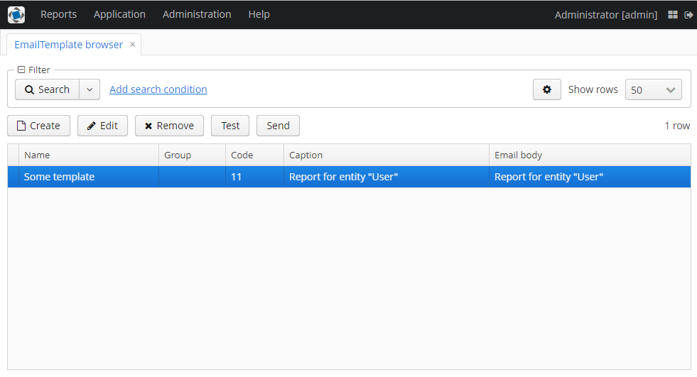
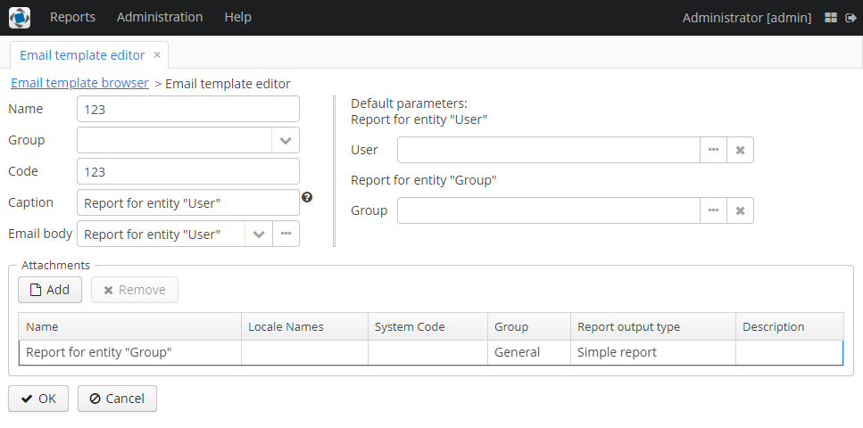
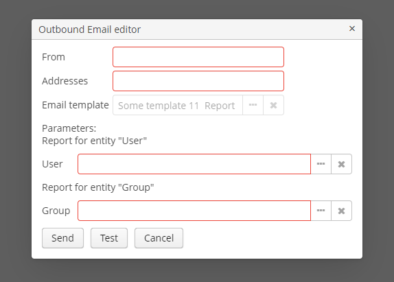

# YARG email template component

This component provide ability to create outbound email based on generating by YARG reporting templates.

## Email template

This functionality of the component allows to create templates of outbound emails.



User may set report as email body. But template may contain one or more reports as attachments.
Also user may set default parameter values to all included reports. User have to use only HTML report templates.



## Outbound email

By the outbound email editor user may set sender and recipient addresses and fill parameters of all reports.
If email template does not contain any reports user will see exception message.



Before sending is displayed preview screen.

## Email templates API

Developer can use the next methods from EmailTemplatesAPI:
1. To create EmailInfo from template that may contain the same reports with different parameter values
```
    EmailInfo generateEmail(EmailTemplate emailTemplate, List<ReportWithParams> params)
```
2. To create EmailInfo by parameters map for all included reports
```
    EmailInfo generateEmail(EmailTemplate emailTemplate, Map<String, Object> params)
```
3. To check that the report input parameter did not change own parameter type
```
    void checkParameterTypeChanged(ReportInputParameter inputParameter, ParameterValue parameterValue)
```
The EmailTemplate class contains caption, body and attachments for email where body is a report 
and attachments is a collection of reports.

The ReportWithParams class is a wrapper for report a map of parameters for that report.

The ParameterValue class is the storage for string representation of default value of parameter with alias and type.

The ReportInputParameter is a class of reporting component.

The EmailInfo is a one of the classes of cuba email service.
