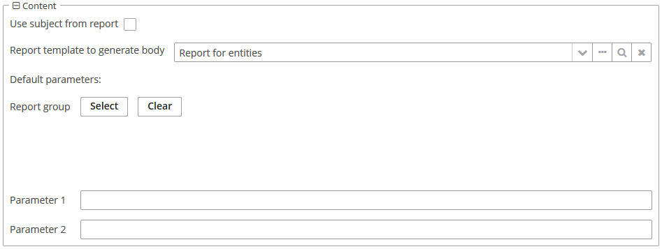
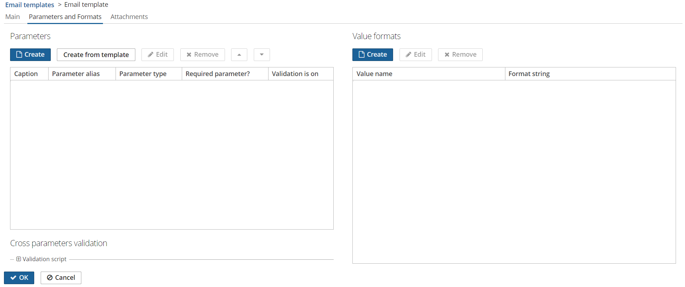
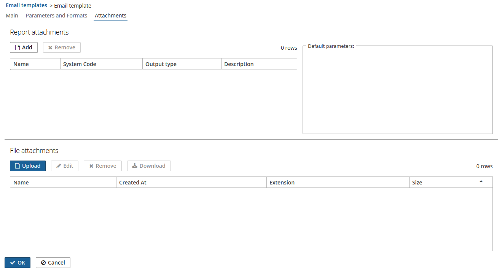
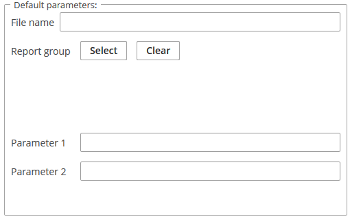
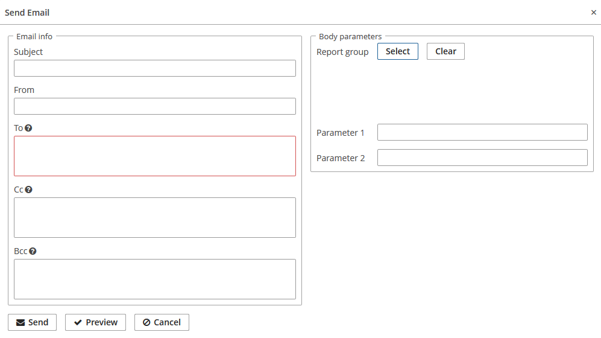

[](http://www.apache.org/licenses/LICENSE-2.0)

- [1. Introduction](#introduction)
- [2. Installation](#installation)  
  - [2.1. Adding the Repository and the Component in CUBA Studio](#adding-cuba)  
  - [2.2. Adding the Repository and the Component in build.gradle](#adding-build)  
- [3. Using the component](#using-the-component)  
  - [3.1. Creating Email Templates](#creating-email-templates)  
    - [3.1.1. Creating Email Template From Report](#creating-from-report)  
    - [3.1.2. Creating Email Template From Designer](#creating-from-designer)  
    - [3.1.3. Setting attachments](#setting-attachments)  
  - [3.2. Setting Groups](#setting-groups)  
  - [3.3. Sending Emails](#sending-emails)  
- [4. Email Templates API](#api)  
  - [4.1 Email Templates Builder](#builder)


# 1. Introduction <a name="introduction"></a>
This component provides the ability to create outbound email based on generating by YARG reporting templates. Using the component, you can create, edit and delete templates, set groups for templates, and send emails.  

Sample application, using this component can be found here: https://github.com/cuba-platform/emailtemplate-addon-demo.

# 2. Installation <a name="installation"></a>

To install the component it is necessary to add repository and component in CUBA Studio or in a `build.gradle` file.
The complete add-ons installation guide see in [CUBA Platform documentation](https://doc.cuba-platform.com/manual-latest/app_components_usage.html).

## 2.1. Adding the Repository and the Component in CUBA Studio <a name="adding-cuba"></a>

1. Click **Edit** in the **Project properties** panel.

2. On the **App components** panel click the **Plus** button next to **Custom components**.

3. Paste the add-on coordinates in the coordinates field as follows: `group:name:version`. For example:

 `com.haulmont.addon.emailtemplates:yet-global:0.2-SNAPSHOT`

 Specify the add-on version compatible with the used version of the CUBA platform.

| Platform Version  | Component Version |
|-------------------|-------------------|
| 6.10.X            | 0.2.+             |

4. Click **OK** in the dialog. Studio will try to find the add-on binaries in the repository currently selected for the project. In case they are found, the dialog will be closed and the add-on will appear in the list of custom components.

5. Click **OK** to save the project properties.

## 2.2. Adding the Repository and the Component in build.gradle <a name="adding-build"></a>

1. Edit `build.gradle` and specify the add-on coordinates in the root `dependencies` section:

```groovy
dependencies {
    appComponent("com.haulmont.cuba:cuba-global:$cubaVersion")
    // your add-ons go here
    appComponent("com.haulmont.addon.emailtemplates:yet-global:0.2-SNAPSHOT")
}
```

2. Execute `gradlew idea` in the command line to include the add-on in your project’s development environment.

3. Edit `web.xml` files in the directory with **core** and **web** modules.  Add the add-on identifier (which is equal to Maven `groupId`) to the space-separated list of application components in the `appComponents` context parameter:

```xml
<context-param>
    <param-name>appComponents</param-name>
    <param-value>com.haulmont.cuba com.haulmont.addon.emailtemplates</param-value>
</context-param>
```

# 3. Using the component <a name="using-the-component"></a>

You can use the following component features.

## 3.1. Creating email templates <a name="creating-email-templates"></a>

The component enables you to create, edit and remove email templates.

To open **Email template browser** press **Email templates** in the **Administration** menu.


There are two ways to create email template: from report and from designer.


### 3.1.1. Creating Email Template From Report <a name="creating-from-report"></a>

The following parameters are available for editing:

- the **Name** field;
- the **Code** field;
- the **Group** drop-down;
- the **Use subject from report** checkbox;
- the **Subject** field (if **Use subject from report** unchecked);
- the **From** field;
- the **To** field;
- the **Cc** field;
- the **Bcc** field;
- the **Report template to generate body** lookup field.


If the report type is a report with an entity you can set entity for a template. In addition, you can set report parameters.


If the report type is a report with entities you can set entities for a template. In addition, you can set report parameters.



### 3.1.2. Creating Email Template From Designer <a name="creating-from-designer"></a>

The following parameters are available for editing:

- the **Name** field;
- the **Code** field;
- the **Group** drop-down;
- the **Subject** field;
- the **From** field;
- the **To** field;
- the **Cc** field;
- the **Bcc** field.

The screen contains the following elements:

- the **Import HTML** button;
- the **HTML code** button;
- the **View HTML** button;
- the **Export Report** button;
- the **HTML Editor**.

This type of creating template provides the ability to use HTML editor. You can design a template with different elements and set every element,  using **Setting** panel.

See more information about using the editor in `README` [for GrapesJs HTML editor](https://github.com/cuba-platform/grapesjs-addon/blob/master/README.md).


To add parameters and value formats go to the **Parameters and Formats** tab.



See the complete parameter guide in [CUBA Platform. Report Generator | External Report Parameters](https://doc.cuba-platform.com/reporting-6.10/parameters.html).

See the complete value format guide in [CUBA Platform. Report Generator | Field Value Formats](https://doc.cuba-platform.com/reporting-6.10/formatters.html).

### 3.1.3. Setting attachments <a name="setting-attachments"></a>
You can add or remove attachments on the **Attachments** tab for both types of templates: from report and from designer. You can attach a report or a file.



You can set the following parameters for a report attachment:

- **File name** - a report attachment name for an addressee;
- an entity or entities for a report;
- parameters from a report.



## 3.2. Setting Groups <a name="setting-groups"></a>

To open group browser click **Groups** in the **Email templates** browser. The screen enables you to create, edit or remove email template groups.


To create or edit the group enter the name of the group.


After setting groups, you can specify a group for a template.

## 3.3. Sending Emails <a name="sending-emails"></a>

To send an email select a template in the list and click **Send**.


The following parameters are available for editing:

- the **Subject** field;
- the **From** field;
- the **To** field;
- the **Cc** field;
- the **Bcc** field.

The **To** field is required. You can select entity or entities for the report and set report parameter.



# 4. Email Templates API <a name="api"></a>

A developer can use the following methods from EmailTemplatesAPI:

1. To create EmailInfo from a template that may contain the same reports with different parameter values:
```
    EmailInfo generateEmail(EmailTemplate emailTemplate, List<ReportWithParams> params)
```
2. To create EmailInfo by parameters map for all included reports:
```
    EmailInfo generateEmail(EmailTemplate emailTemplate, Map<String, Object> params)
```
3. To check that the report input parameter did not change its parameter type:
```
    void checkParameterTypeChanged(ReportInputParameter inputParameter, ParameterValue parameterValue)
```

The EmailTemplate entity contains subject, body, and attachments. It also contains from, to, cc, bcc addresses.

The ReportWithParams is a wrapper class that represents a report and a map of parameters for that report.

The ParameterValue is a class that provides a string representation of the parameter with alias and type.

The ReportInputParameter is a class of Reporting component.

The EmailInfo is a class of CUBA EmailService.

## 4.1. Email Templates Builder <a name="builder"></a>

Email templates API contains builder that can create and fill EmailTemplate entity.

EmailTemplateBuilderImpl is an implementation of EmailTemplateBuilder that provides intermediate methods for
setting and adding email template properties. It also contains terminal methods that can build EmailTemplate,
generate or send EmailInfo.

A copy of the specified EmailTemplate is created in the constructor. Every intermediate method fills the created copy.
```
    public EmailTemplateBuilderImpl(EmailTemplate emailTemplate) {
        this.emailTemplate = cloneTemplate(emailTemplate);
    }
```
The `build()` method creates the copy from the copy inside builder. It is necessary to save a state of the existed entity or builder.

Example of using the builder:
```
    EmailTemplate newTemplate = emailTemplatesAPI.buildFromTemplate(emailTemplate)
            .setSubject("Test subject")
            .setTo("address@haulmont.com")
            .setBodyParameter("entity", someEntity)
            .setAttachmentParameters(reportsWithParams)
            .build();
```
