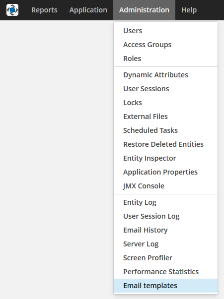

[](http://www.apache.org/licenses/LICENSE-2.0)

# 1. Introduction
This component provide ability to create outbound email based on generating by YARG reporting templates.

# 2. Installation

The complete add-ons installation guide see in [CUBA Platform documentation](https://doc.cuba-platform.com/manual-latest/app_components_usage.html).

## 2.1. Add the Repository and the Component in CUBA Studio

1. Edit **Project properties** and on the **App components** panel click the **plus** button next to **Custom components**.

2. Paste the add-on coordinates in the coordinates field as follows: `group:name:version`. For example:

    com.haulmont.addon.emailtemplates:yet-global:0.2-SNAPSHOT

Select the add-on version compatible with the CUBA platform version used in your project:

| Platform Version  | Component Version |
|-------------------|-------------------|
| 6.10.X            | 0.2.+             |

3. Click **OK** in the dialog. Studio will try to find the add-on binaries in the repository currently selected for the project. If it is found, the dialog will close and the add-on will appear in the list of custom components.

4. Save the project properties by clicking **OK**.

## 2.2. Add the Repository and the Component in build.gradle

1. Edit `build.gradle` and specify the add-on coordinates in the root `dependencies` section:

```groovy
dependencies {
    appComponent("com.haulmont.cuba:cuba-global:$cubaVersion")
    // your add-ons go here
    appComponent("com.haulmont.addon.emailtemplates:yet-global:0.2-SNAPSHOT")
}
```

2. Execute `gradlew idea` in the command line to include add-on in your project’s development environment.

3. Edit `web.xml` files of the **core** and **web** modules and add the add-on identifier (which is equal to Maven `groupId`) to the space-separated list of application components in the `appComponents` context parameter:

```xml
<context-param>
    <param-name>appComponents</param-name>
    <param-value>com.haulmont.cuba com.haulmont.addon.emailtemplates</param-value>
</context-param>
```

# 3. Screens

## 3.1. Email Template Browser

This screen allows creating, editing and removing email templates. This screen is available from the application menu.




## 3.2. Email Template Editor

There are two ways to create email template: from report and from designer.


## 3.2.1. Email Template Editor From Report

The screen to create template from report allows editing parameters:

- the **Name** field;
- the **Code** field;
- the **Group** drop-down;
- the **Use subject from report** checkbox;
- the **Subject** field (if **Use subject from report** unchecked);
- the **From** field;
- the **To** field;
- the **Cc** field;
- the **Bcc** field;
- the **Email body report** lookup field.


If the report type is report with entity user can set entity for template. User can set report parameters as well.


If the report type is report with entities user can set entities for template. User can set report parameters as well.


## 3.2.2. Email Template Editor From Designer

The screen to create template from designer consists of the following elements:

- the **Name** field;
- the **Code** field;
- the **Group** drop-down;
- the **Subject** field;
- the **From** field;
- the **To** field;
- the **Cc** field;
- the **Bcc** field;
- the **Import JSON** button;
- the **Export JSON** button;
- the **Export HTML** button;
- the **View HTML** button;
- the **Export Report** button.

User can design template with elements:

- **Button**
- **Divider**
- **HTML**
- **Image**
- **Text**


User can add parameters and value formats on the **Parameters and Formats** tab.


The complete parameter guide see in [CUBA Platform. Report Generator | External Report Parameters](https://doc.cuba-platform.com/reporting-6.10/parameters.html).

The complete value format guide see in [CUBA Platform. Report Generator | Field Value Formats](https://doc.cuba-platform.com/reporting-6.10/formatters.html).

## 3.2.3. Attachment tab

User can add or remove attachments on the Attachment tab for both types of templates (from report and from designer). User can attach a report or a file.


User can set for a report attachment parameters:

- **File name** - name of report attachment for addressee;
- entity or entities for report;
- parameters from report.


## 3.3. Group Editor

The screen to create, edit or remove email template groups.


## 3.4. Email Sender

The screen to send email with a email template. User can fill parameters

- **Subject**;
- **From**;
- **To**;
- **Cc**;
- **Bcc**.

The "To" field is obligatory to set. User can select entity or entities for report/-s and set report parameter.


## 4. Email templates API

Developer can use the next methods from EmailTemplatesAPI:
1. To create EmailInfo from template that may contain the same reports with different parameter values
```
    EmailInfo generateEmail(EmailTemplate emailTemplate, List<ReportWithParams> params)
```
2. To create EmailInfo by parameters map for all included reports
```
    EmailInfo generateEmail(EmailTemplate emailTemplate, Map<String, Object> params)
```
3. To check that the report input parameter did not change own parameter type
```
    void checkParameterTypeChanged(ReportInputParameter inputParameter, ParameterValue parameterValue)
```

The EmailTemplate entity contains subject, body and attachments. It also contains from, to, cc, bcc addresses.

The ReportWithParams class is a wrapper for report a map of parameters for that report.

The ParameterValue class is the storage for string representation of default value of parameter with alias and type.

The ReportInputParameter is a class of reporting component.

The EmailInfo is a one of the classes of cuba email service.

#### Email templates builder

Email templates API contains builder that can create and fill EmailTemplate entity.
EmailTemplateBuilderImpl is implementation of EmailTemplateBuilder that provides intermediate methods for 
setting and adding email template properties. It also contains terminal methods that can build EmailTemplate,
generate or send EmailInfo.

In constructor is created a copy of specified EmailTemplate. Everything intermediate methods fill created copy.
```
    public EmailTemplateBuilderImpl(EmailTemplate emailTemplate) {
        this.emailTemplate = cloneTemplate(emailTemplate);
    }
```
The build() method creates the copy from the copy inside builder. It necessary to save state of existed entity or builder.

Example of using the builder:
```
    EmailTemplate newTemplate = emailTemplatesAPI.buildFromTemplate(emailTemplate)
            .setSubject("Test subject")
            .setTo("address@haulmont.com")
            .setBodyParameter("entity", someEntity)
            .setAttachmentParameters(reportsWithParams)
            .build();
```